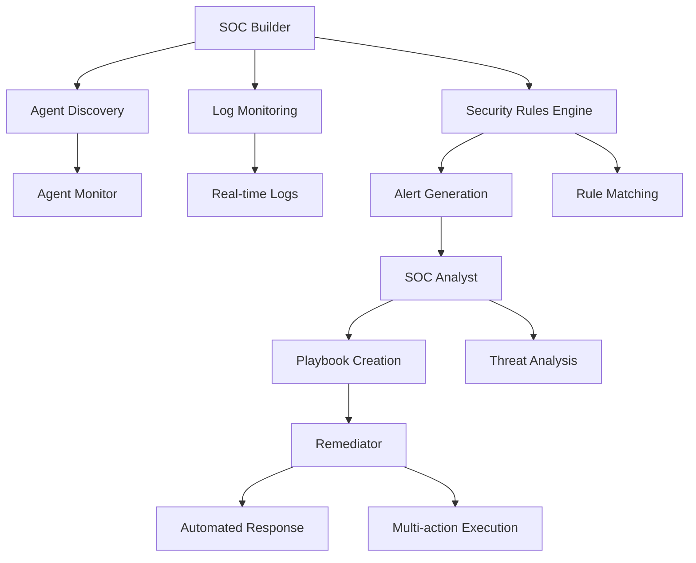

# Generic SOC AI Agents Security System

A comprehensive, environment-agnostic Security Operations Center (SOC) system designed to monitor and secure any AI agent environment. This system can automatically discover AI agents, apply security rules, and provide automated remediation capabilities.

## 🚀 Features

### 🔍 **Generic Agent Discovery**
- Automatically scans and discovers AI agents in any environment
- Supports multiple agent types: Medical, Financial, Customer Service, Code Assistant, Research, and General
- Configurable scan paths and file patterns
- Real-time agent monitoring and activity tracking

### 🛡️ **Comprehensive Security Rules**
- **Prompt Injection Detection**: Detects attempts to override AI instructions
- **Data Exfiltration Prevention**: Identifies attempts to extract sensitive data
- **System Manipulation Protection**: Monitors for malicious system commands
- **Privacy Violation Detection**: Protects sensitive data in medical/financial contexts
- **Rate Limiting & Abuse Prevention**: Prevents API abuse and DoS attacks
- **Malicious Input Filtering**: Detects XSS, injection, and other malicious inputs

### 🎯 **Environment-Specific Configurations**
- **Medical Environment**: HIPAA compliance, patient data protection
- **Financial Environment**: PCI/SOX compliance, financial data security
- **Development Environment**: Code security, development tool protection
- **Production Environment**: Maximum security with strict policies

### 🔧 **Automated Remediation**
- Multi-action playbooks for complex responses
- IP blocking and user suspension
- Agent isolation and enhanced monitoring
- Compliance notifications and forensic initiation
- Human review workflows for complex cases

## 📁 Project Structure

```
SOC ai agents/
├── main.py                 # Main execution and CLI
├── soc_builder.py          # Generic SOC Builder (agent discovery & monitoring)
├── soc_analyst.py          # SOC Analyst (alert analysis & playbook creation)
├── remediator.py           # Remediator (automated response execution)
├── security_rules.py       # Security rules engine
├── agent_monitor.py        # Agent discovery and monitoring
├── environment_config.py   # Environment configuration system
├── models.py              # Data models and enums
├── message_bus.py         # Inter-agent communication
├── config.py              # System configuration
├── logging_config.py      # Logging setup
└── tests.py               # Unit tests
```

## 🚀 Quick Start

### 1. Basic Usage

```bash
# Run with default development environment
python main.py

# Run with specific environment
python main.py --environment medical

# Run for specific duration
python main.py --duration 30

# Enable real remediation (use with caution!)
python main.py --real
```

### 2. Environment Presets

```bash
# Medical AI environment (HIPAA compliance)
python main.py --environment medical

# Financial AI environment (PCI/SOX compliance)
python main.py --environment financial

# Development environment (relaxed policies)
python main.py --environment development

# Production environment (maximum security)
python main.py --environment production
```

### 3. Advanced Options

```bash
# Run smoke test
python main.py --smoke-test

# Run unit tests
python main.py --run-tests

# Custom logging level
python main.py --log-level DEBUG

# Custom duration (0 = indefinite)
python main.py --duration 0
```

## 🔧 Configuration

### Environment Configuration

The system uses `environment_config.py` to manage different environment presets:

```python
from environment_config import EnvironmentConfig

# Create configuration
config = EnvironmentConfig()

# Apply preset
config.apply_preset("medical")

# Custom configuration
config.add_scan_path("./my_agents")
config.enable_rule("CUSTOM_RULE_001")
config.save_config()
```

### Security Rules

Add custom security rules:

```python
from models import SecurityRule, ThreatType, AgentType

custom_rule = SecurityRule(
    rule_id="CUSTOM_001",
    name="Custom Threat Detection",
    description="Detects custom threats",
    threat_type=ThreatType.MALICIOUS_INPUT,
    severity="high",
    patterns=["custom_pattern"],
    agent_types=[AgentType.GENERAL]
)

# Add to SOC Builder
builder.add_custom_rule(custom_rule)
```

## 🛡️ Security Rules Reference

### Prompt Injection Rules
- **PROMPT_INJ_001**: Basic prompt injection detection
- **PROMPT_INJ_002**: Advanced prompt injection with system tokens

### Data Exfiltration Rules
- **DATA_EXF_001**: API key and credential extraction
- **DATA_EXF_002**: Database access attempts

### System Manipulation Rules
- **SYS_MAN_001**: System command execution
- **SYS_MAN_002**: File system access

### Domain-Specific Rules
- **MED_001**: Medical data privacy violations
- **FIN_001**: Financial data access attempts

### General Security Rules
- **RATE_001**: Rate limit abuse detection
- **MAL_INP_001**: Malicious input patterns

## 🔄 System Architecture



## 📊 Monitoring & Analytics

The system provides comprehensive monitoring:

- **Agent Discovery Statistics**: Number of agents found, types, security levels
- **Security Metrics**: Alerts generated, rules triggered, false positive rates
- **Performance Metrics**: Log processing rates, response times
- **Compliance Reporting**: Audit trails, compliance notifications

## 🔒 Security Considerations

### Production Deployment

1. **Enable Real Mode Carefully**: Only enable `--real` in controlled environments
2. **Review Playbooks**: Always review auto-generated playbooks before execution
3. **Monitor Logs**: Set up comprehensive logging and monitoring
4. **Regular Updates**: Keep security rules updated with latest threats

### Compliance

- **HIPAA**: Medical environment preset includes HIPAA compliance features
- **PCI DSS**: Financial environment preset includes PCI compliance
- **SOX**: Financial environment includes SOX compliance features
- **GDPR**: Privacy violation detection and data protection

## 🧪 Testing

```bash
# Run smoke test
python main.py --smoke-test

# Run unit tests
python main.py --run-tests

# Test specific environment
python main.py --environment medical --duration 10
```

## 🔧 Integration Examples

### Medical AI Environment

```python
# Configure for medical environment
config = EnvironmentConfig()
config.configure_for_medical_environment()

# This enables:
# - HIPAA compliance monitoring
# - Patient data protection rules
# - Medical-specific threat detection
# - Compliance notifications
```

### Financial AI Environment

```python
# Configure for financial environment
config = EnvironmentConfig()
config.configure_for_financial_environment()

# This enables:
# - PCI/SOX compliance monitoring
# - Financial data protection
# - Transaction monitoring
# - Audit trail requirements
```

## 📈 Performance

- **Agent Discovery**: Scans 1000+ files in seconds
- **Log Processing**: Handles 1000+ logs per second
- **Rule Matching**: Sub-millisecond pattern matching
- **Alert Generation**: Real-time threat detection

## 🤝 Contributing

1. Fork the repository
2. Create a feature branch
3. Add tests for new functionality
4. Submit a pull request

## 📄 License

This project is licensed under the MIT License - see the LICENSE file for details.

## ⚠️ Disclaimer

This system is designed for educational and research purposes. Always test thoroughly in non-production environments before deploying to production systems. The automated remediation features should be carefully configured and monitored.

## 🆘 Support

For issues and questions:
1. Check the documentation
2. Run the smoke test to verify installation
3. Review the logs for error messages
4. Open an issue with detailed information

---

**Built with ❤️ for AI Security**